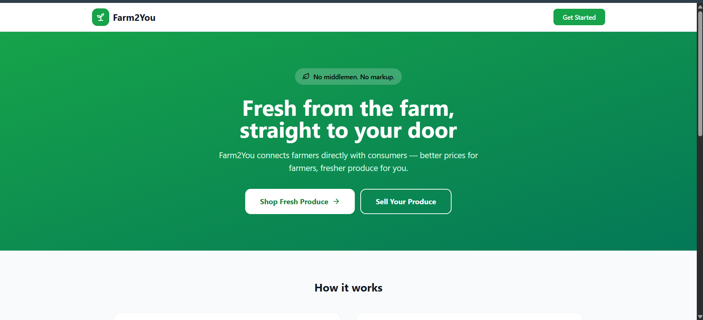
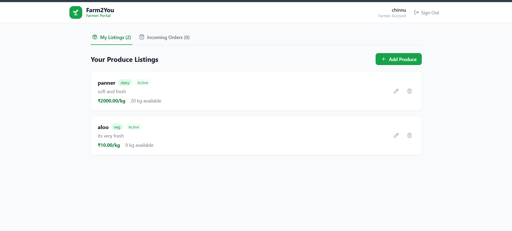
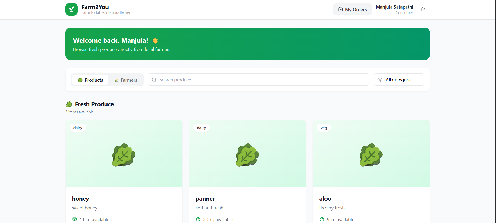

# 🌱 Farm2You - Farmer Direct Sales Portal

A full-stack web application that connects farmers directly with consumers, eliminating middlemen and enabling fair pricing, fresh produce, and transparent transactions.

## 🚀 Live Demo

Frontend: https://farm2-you-frontend.vercel.app

## 📸 Screenshots

| Home Page | Farmer Dashboard |
|------------|------------|
|  |  |

| Consumer Dashboard |
|------------|
|  |

## 📂 GitHub Repository

https://github.com/Manjula1307/Farm2You

---

## 📖 Overview

Farm2You is a role-based marketplace where farmers can list agricultural products and consumers can browse, purchase, and track orders.

The platform aims to reduce dependency on intermediaries and create a direct digital connection between producers and buyers.

---

## ✨ Key Features

### Authentication & Authorization

* Secure JWT-based authentication
* Role-based access control
* Farmer and Consumer accounts
* Protected API routes

### Farmer Features

* Register and manage farmer profile
* Add new produce listings
* Update product details
* Manage inventory
* View incoming orders
* Track sales activity

### Consumer Features

* Browse available produce
* Search and view product listings
* Place orders directly from farmers
* View order history
* Track purchase activity

### Platform Features

* Responsive design
* Secure password hashing using bcrypt
* RESTful API architecture
* Persistent MySQL database
* Cloud deployment

---

## 🛠️ Tech Stack

### Frontend

* React.js
* Vite
* Tailwind CSS
* Axios
* Lucide React Icons

### Backend

* Node.js
* Express.js
* JWT Authentication
* bcrypt.js

### Database

* MySQL

### Deployment

* Vercel (Frontend)
* Render (Backend)
* Railway (MySQL Database)

---

## 🏗️ System Architecture

Frontend (React + Vite)
↓
REST API (Node.js + Express)
↓
MySQL Database (Railway)

---

## 🔐 Authentication Flow

1. User registers as Farmer or Consumer
2. Password is hashed using bcrypt
3. JWT token is generated upon login
4. Token is stored in localStorage
5. Protected routes verify JWT before access

---

## 📁 Project Structure

Farm2You/
│
├── frontend/
│ ├── src/
│ │ ├── api/
│ │ ├── components/
│ │ ├── context/
│ │ ├── hooks/
│ │ ├── pages/
│ │ └── App.jsx
│ │
│ └── package.json
│
├── backend/
│ ├── controllers/
│ ├── middleware/
│ ├── routes/
│ ├── config/
│ ├── models/
│ └── server.js
│
└── README.md

---

## ⚙️ Installation

### Clone Repository

```bash
git clone https://github.com/Manjula1307/Farm2You.git
cd Farm2You
```

### Frontend Setup

```bash
cd frontend

npm install

npm run dev
```

### Backend Setup

```bash
cd backend

npm install

npm run dev
```

---

## Environment Variables

### Backend (.env)

```env
PORT=5000

DB_HOST=your_host
DB_PORT=your_port
DB_USER=your_user
DB_PASSWORD=your_password
DB_NAME=your_database

JWT_SECRET=your_secret_key
JWT_EXPIRES_IN=7d
```

### Frontend (.env)

```env
VITE_API_URL=https://your-backend-url/api
```

---

## API Endpoints

### Authentication

| Method | Endpoint           | Description      |
| ------ | ------------------ | ---------------- |
| POST   | /api/auth/register | Register user    |
| POST   | /api/auth/login    | Login user       |
| GET    | /api/auth/me       | Get current user |

### Produce

| Method | Endpoint                |
| ------ | ----------------------- |
| GET    | /api/farmer/my-listings |
| POST   | /api/farmer/listings    |
| GET    | /api/produce            |

### Orders

| Method | Endpoint       |
| ------ | -------------- |
| POST   | /api/orders    |
| GET    | /api/orders/my |

---

## Challenges Solved

* Implemented secure JWT authentication
* Built role-based user access
* Connected React frontend with Express backend
* Integrated Railway MySQL database with cloud deployment
* Managed API communication using Axios
* Deployed full-stack application across multiple cloud services

---

## Future Improvements

* Payment Gateway Integration
* Real-time Order Tracking
* Product Reviews & Ratings
* Farmer Analytics Dashboard
* Image Upload Support
* Notification System
* AI-Based Produce Recommendations

---

## Author

Manjula

Full Stack Developer | React.js | Node.js | MySQL

LinkedIn: https://www.linkedin.com/in/manjula-satapathi

GitHub: https://github.com/Manjula1307

---

## License

This project is built for educational and portfolio purposes.
